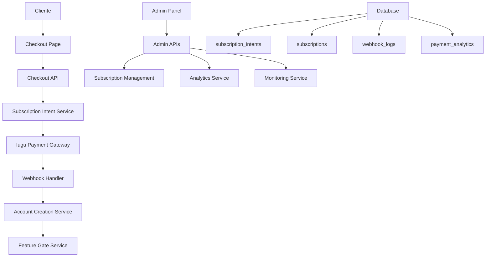
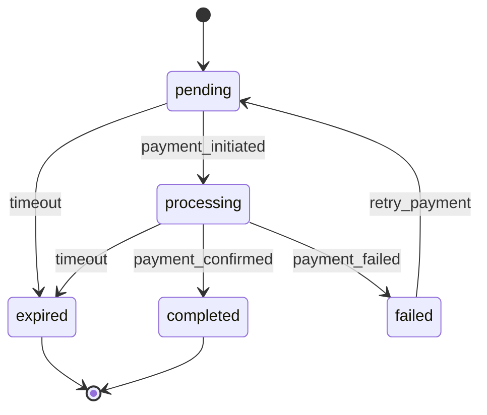

# Design Document - Correção Completa do Fluxo de Checkout e Pagamentos

## Overview

Esta solução implementa uma arquitetura robusta e resiliente para o fluxo completo de checkout e pagamentos, corrigindo falhas críticas existentes e implementando ferramentas administrativas avançadas. O design foca em confiabilidade, observabilidade e experiência do usuário.

## Architecture

### High-Level Architecture



### Core Components

1. **Enhanced Checkout System**: Interface e APIs melhoradas para processo de compra
2. **Subscription Intent Management**: Gerenciamento completo de intenções de assinatura
3. **Robust Webhook Processing**: Processamento confiável de eventos de pagamento
4. **Admin Management Suite**: Ferramentas administrativas completas
5. **Monitoring & Analytics**: Observabilidade e métricas de negócio

## Components and Interfaces

### 1. Database Schema Enhancements

#### Subscription Intents Table (CRÍTICO - Faltando)
```sql
CREATE TABLE subscription_intents (
  id UUID PRIMARY KEY DEFAULT uuid_generate_v4(),
  plan_id UUID NOT NULL REFERENCES subscription_plans(id),
  billing_cycle VARCHAR(10) NOT NULL,
  status VARCHAR(20) NOT NULL DEFAULT 'pending',
  user_email VARCHAR(255) NOT NULL,
  user_name VARCHAR(255) NOT NULL,
  organization_name VARCHAR(255) NOT NULL,
  cpf_cnpj VARCHAR(20),
  phone VARCHAR(20),
  iugu_customer_id VARCHAR(255),
  iugu_subscription_id VARCHAR(255),
  checkout_url TEXT,
  user_id UUID REFERENCES auth.users(id),
  metadata JSONB DEFAULT '{}',
  expires_at TIMESTAMP WITH TIME ZONE,
  completed_at TIMESTAMP WITH TIME ZONE,
  created_at TIMESTAMP WITH TIME ZONE DEFAULT NOW(),
  updated_at TIMESTAMP WITH TIME ZONE DEFAULT NOW()
);
```

#### Webhook Logs Table
```sql
CREATE TABLE webhook_logs (
  id UUID PRIMARY KEY DEFAULT uuid_generate_v4(),
  event_type VARCHAR(100) NOT NULL,
  event_id VARCHAR(255),
  subscription_intent_id UUID REFERENCES subscription_intents(id),
  payload JSONB NOT NULL,
  status VARCHAR(20) NOT NULL DEFAULT 'received',
  processed_at TIMESTAMP WITH TIME ZONE,
  error_message TEXT,
  retry_count INTEGER DEFAULT 0,
  created_at TIMESTAMP WITH TIME ZONE DEFAULT NOW()
);
```

#### Payment Analytics Table
```sql
CREATE TABLE payment_analytics (
  id UUID PRIMARY KEY DEFAULT uuid_generate_v4(),
  date DATE NOT NULL,
  checkouts_started INTEGER DEFAULT 0,
  checkouts_completed INTEGER DEFAULT 0,
  payments_confirmed INTEGER DEFAULT 0,
  revenue_total DECIMAL(10,2) DEFAULT 0,
  plan_id UUID REFERENCES subscription_plans(id),
  created_at TIMESTAMP WITH TIME ZONE DEFAULT NOW()
);
```

### 2. Enhanced Checkout Flow

#### Checkout Page Improvements
- **Status Tracking**: Página de status em tempo real
- **Error Handling**: Mensagens de erro claras e ações de recuperação
- **Progress Indicators**: Indicadores visuais do progresso
- **Mobile Optimization**: Interface responsiva otimizada

#### Checkout API Enhancements
```typescript
interface CheckoutRequest {
  plan_id: string;
  billing_cycle: 'monthly' | 'annual';
  user_data: {
    name: string;
    email: string;
    organization_name: string;
    cpf_cnpj?: string;
    phone?: string;
  };
  metadata?: Record<string, any>;
}

interface CheckoutResponse {
  success: boolean;
  intent_id: string;
  checkout_url: string;
  status_url: string;
  expires_at: string;
}
```

### 3. Subscription Intent Service

#### Core Functionality
- **Intent Creation**: Criação segura de intenções de assinatura
- **Status Management**: Gerenciamento de estados do ciclo de vida
- **Expiration Handling**: Limpeza automática de intents expirados
- **Retry Logic**: Tentativas automáticas para falhas temporárias

#### State Machine


### 4. Robust Webhook Handler

#### Event Processing Pipeline
1. **Validation**: Verificação de assinatura e payload
2. **Deduplication**: Prevenção de processamento duplicado
3. **Processing**: Lógica de negócio para cada tipo de evento
4. **Retry Logic**: Tentativas automáticas com backoff exponencial
5. **Dead Letter Queue**: Armazenamento de eventos não processáveis

#### Webhook Event Types
```typescript
interface WebhookEvent {
  id: string;
  type: 'invoice.status_changed' | 'subscription.activated' | 'subscription.suspended';
  data: any;
  created_at: string;
}

interface WebhookProcessor {
  process(event: WebhookEvent): Promise<ProcessingResult>;
  retry(event: WebhookEvent, attempt: number): Promise<void>;
  handleFailure(event: WebhookEvent, error: Error): Promise<void>;
}
```

### 5. Account Creation Service

#### Automated Account Setup
- **User Creation**: Criação automática de contas no Supabase Auth
- **Organization Setup**: Criação de organização e membership
- **Welcome Email**: Envio de email de boas-vindas com instruções
- **Password Reset**: Link para definição de senha inicial

#### Security Considerations
- **Email Verification**: Verificação automática de email
- **Temporary Passwords**: Senhas temporárias seguras
- **Rate Limiting**: Proteção contra criação em massa
- **Audit Trail**: Log completo de criações de conta

### 6. Admin Management Suite

#### Subscription Management Interface
```typescript
interface AdminSubscriptionView {
  intent_id: string;
  customer_info: CustomerInfo;
  plan_details: PlanDetails;
  payment_status: PaymentStatus;
  timeline: TimelineEvent[];
  actions: AdminAction[];
}

interface AdminAction {
  type: 'activate' | 'cancel' | 'resend' | 'refund';
  enabled: boolean;
  confirmation_required: boolean;
}
```

#### Analytics Dashboard
- **Conversion Metrics**: Funil de conversão detalhado
- **Revenue Analytics**: Análise de receita por período e plano
- **Abandonment Analysis**: Análise de abandono de carrinho
- **Performance Monitoring**: Métricas de performance do sistema

### 7. Enhanced Feature Gate Service

#### Caching Strategy
```typescript
interface FeatureGateCache {
  getSubscriptionStatus(orgId: string): Promise<SubscriptionStatus>;
  invalidateCache(orgId: string): Promise<void>;
  warmupCache(orgIds: string[]): Promise<void>;
}
```

#### Real-time Updates
- **Subscription Changes**: Atualização imediata de permissões
- **WebSocket Integration**: Notificações em tempo real
- **Graceful Degradation**: Fallback para verificação direta

## Data Models

### Subscription Intent Lifecycle
```typescript
interface SubscriptionIntent {
  id: string;
  plan_id: string;
  billing_cycle: BillingCycle;
  status: IntentStatus;
  user_data: UserData;
  payment_data: PaymentData;
  timeline: TimelineEvent[];
  metadata: Record<string, any>;
  created_at: string;
  updated_at: string;
  expires_at: string;
}

type IntentStatus = 'pending' | 'processing' | 'completed' | 'failed' | 'expired';
```

### Analytics Data Model
```typescript
interface CheckoutAnalytics {
  period: DateRange;
  metrics: {
    checkouts_started: number;
    checkouts_completed: number;
    conversion_rate: number;
    average_time_to_complete: number;
    abandonment_points: AbandonmentPoint[];
  };
  revenue: RevenueMetrics;
  plans: PlanPerformance[];
}
```

## Error Handling

### Error Categories
1. **Validation Errors**: Dados inválidos do usuário
2. **Payment Errors**: Falhas no gateway de pagamento
3. **System Errors**: Falhas internas do sistema
4. **Network Errors**: Problemas de conectividade
5. **Rate Limit Errors**: Limites de API excedidos

### Recovery Strategies
```typescript
interface ErrorRecoveryStrategy {
  retryable: boolean;
  max_retries: number;
  backoff_strategy: 'linear' | 'exponential';
  fallback_action?: string;
  user_message: string;
}
```

### Circuit Breaker Pattern
```typescript
interface CircuitBreaker {
  state: 'closed' | 'open' | 'half-open';
  failure_threshold: number;
  recovery_timeout: number;
  execute<T>(operation: () => Promise<T>): Promise<T>;
}
```

## Testing Strategy

### Unit Tests
- **Service Layer**: Testes de lógica de negócio
- **API Endpoints**: Testes de validação e resposta
- **Webhook Processing**: Testes de processamento de eventos
- **Error Handling**: Testes de cenários de falha

### Integration Tests
- **End-to-End Flow**: Teste completo do fluxo de checkout
- **Webhook Integration**: Testes com simulação do Iugu
- **Database Operations**: Testes de persistência
- **External APIs**: Testes com mocks de serviços externos

### Performance Tests
- **Load Testing**: Testes de carga no checkout
- **Stress Testing**: Testes de limite do sistema
- **Webhook Processing**: Performance de processamento em lote
- **Database Performance**: Otimização de queries

## Security Considerations

### Data Protection
- **PII Encryption**: Criptografia de dados pessoais
- **Secure Storage**: Armazenamento seguro de tokens
- **Access Control**: Controle de acesso baseado em roles
- **Audit Logging**: Log completo de operações sensíveis

### API Security
- **Rate Limiting**: Proteção contra abuso
- **Input Validation**: Validação rigorosa de entrada
- **CORS Configuration**: Configuração adequada de CORS
- **Webhook Verification**: Verificação de assinatura de webhooks

## Monitoring and Observability

### Metrics Collection
```typescript
interface CheckoutMetrics {
  checkout_started_total: Counter;
  checkout_completed_total: Counter;
  checkout_duration_seconds: Histogram;
  webhook_processing_duration: Histogram;
  payment_errors_total: Counter;
}
```

### Alerting Rules
- **High Error Rate**: Taxa de erro > 5%
- **Slow Response Time**: Tempo de resposta > 5s
- **Webhook Failures**: Falhas consecutivas > 3
- **Low Conversion Rate**: Taxa de conversão < 70%

### Dashboards
1. **Business Metrics**: Conversão, receita, abandono
2. **Technical Metrics**: Performance, erros, disponibilidade
3. **Operational Metrics**: Webhooks, processamento, filas