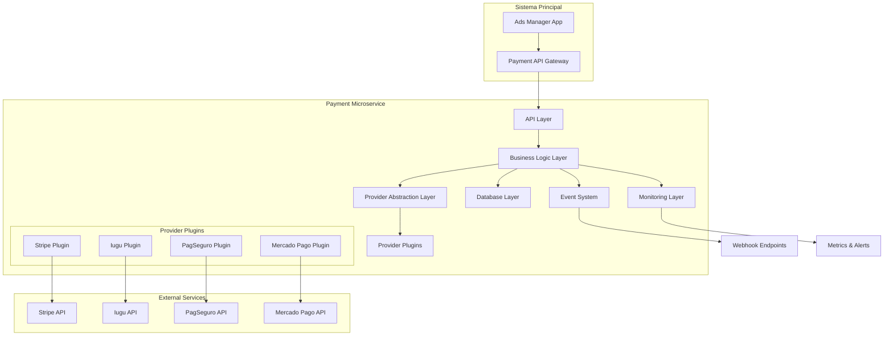
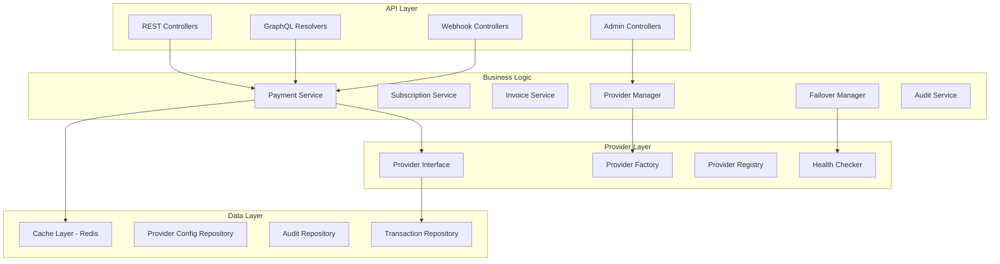

# Design Document - Microserviço de Pagamentos

## Overview

O microserviço de pagamentos será desenvolvido em Node.js com TypeScript, utilizando arquitetura hexagonal (ports and adapters) para máxima flexibilidade. O sistema implementará padrões como Strategy, Factory e Observer para suportar múltiplos provedores de forma plugável.

## Architecture

### High-Level Architecture



### Microservice Internal Architecture



## Components and Interfaces

### Core Interfaces

#### IPaymentProvider
```typescript
interface IPaymentProvider {
  name: string;
  version: string;
  
  // Configuration
  configure(config: ProviderConfig): Promise<void>;
  validateConfig(config: ProviderConfig): Promise<boolean>;
  
  // Payment Operations
  createPayment(request: PaymentRequest): Promise<PaymentResponse>;
  capturePayment(paymentId: string): Promise<PaymentResponse>;
  refundPayment(paymentId: string, amount?: number): Promise<RefundResponse>;
  
  // Subscription Operations
  createSubscription(request: SubscriptionRequest): Promise<SubscriptionResponse>;
  updateSubscription(subscriptionId: string, updates: SubscriptionUpdate): Promise<SubscriptionResponse>;
  cancelSubscription(subscriptionId: string): Promise<SubscriptionResponse>;
  
  // Webhook Operations
  validateWebhook(payload: string, signature: string): boolean;
  parseWebhook(payload: string): WebhookEvent;
  
  // Health Check
  healthCheck(): Promise<HealthStatus>;
}
```

#### IPaymentGateway
```typescript
interface IPaymentGateway {
  processPayment(request: PaymentRequest, options?: ProcessingOptions): Promise<PaymentResult>;
  processSubscription(request: SubscriptionRequest): Promise<SubscriptionResult>;
  handleWebhook(providerName: string, payload: string, signature: string): Promise<void>;
  getProviderStatus(): Promise<ProviderStatus[]>;
}
```

### Provider Plugin System

#### Plugin Structure
```
plugins/
├── stripe/
│   ├── index.ts
│   ├── stripe-provider.ts
│   ├── stripe-types.ts
│   └── package.json
├── iugu/
│   ├── index.ts
│   ├── iugu-provider.ts
│   ├── iugu-types.ts
│   └── package.json
└── base/
    ├── base-provider.ts
    └── provider-types.ts
```

#### Plugin Registration
```typescript
class ProviderRegistry {
  private providers: Map<string, IPaymentProvider> = new Map();
  
  async loadPlugin(pluginPath: string): Promise<void> {
    const plugin = await import(pluginPath);
    const provider = new plugin.default();
    this.providers.set(provider.name, provider);
  }
  
  getProvider(name: string): IPaymentProvider | null {
    return this.providers.get(name) || null;
  }
  
  getAllProviders(): IPaymentProvider[] {
    return Array.from(this.providers.values());
  }
}
```

## Data Models

### Core Entities

#### Transaction
```typescript
interface Transaction {
  id: string;
  organizationId: string;
  providerName: string;
  providerTransactionId: string;
  type: 'payment' | 'refund' | 'subscription';
  status: TransactionStatus;
  amount: number;
  currency: string;
  metadata: Record<string, any>;
  createdAt: Date;
  updatedAt: Date;
  completedAt?: Date;
  failureReason?: string;
}
```

#### ProviderConfig
```typescript
interface ProviderConfig {
  id: string;
  name: string;
  isActive: boolean;
  priority: number;
  credentials: Record<string, string>; // Encrypted
  settings: Record<string, any>;
  healthCheckUrl?: string;
  webhookUrl?: string;
  createdAt: Date;
  updatedAt: Date;
}
```

#### PaymentRequest
```typescript
interface PaymentRequest {
  amount: number;
  currency: string;
  organizationId: string;
  customerId?: string;
  paymentMethodId?: string;
  description?: string;
  metadata?: Record<string, any>;
  returnUrl?: string;
  cancelUrl?: string;
}
```

### Database Schema

```sql
-- Transactions table
CREATE TABLE transactions (
  id UUID PRIMARY KEY DEFAULT gen_random_uuid(),
  organization_id UUID NOT NULL,
  provider_name VARCHAR(50) NOT NULL,
  provider_transaction_id VARCHAR(255),
  type VARCHAR(20) NOT NULL,
  status VARCHAR(20) NOT NULL,
  amount DECIMAL(12,2) NOT NULL,
  currency VARCHAR(3) NOT NULL,
  metadata JSONB DEFAULT '{}',
  created_at TIMESTAMP WITH TIME ZONE DEFAULT NOW(),
  updated_at TIMESTAMP WITH TIME ZONE DEFAULT NOW(),
  completed_at TIMESTAMP WITH TIME ZONE,
  failure_reason TEXT
);

-- Provider configurations
CREATE TABLE provider_configs (
  id UUID PRIMARY KEY DEFAULT gen_random_uuid(),
  name VARCHAR(50) UNIQUE NOT NULL,
  is_active BOOLEAN DEFAULT true,
  priority INTEGER DEFAULT 0,
  credentials_encrypted TEXT NOT NULL,
  settings JSONB DEFAULT '{}',
  health_check_url VARCHAR(500),
  webhook_url VARCHAR(500),
  created_at TIMESTAMP WITH TIME ZONE DEFAULT NOW(),
  updated_at TIMESTAMP WITH TIME ZONE DEFAULT NOW()
);

-- Audit logs
CREATE TABLE audit_logs (
  id UUID PRIMARY KEY DEFAULT gen_random_uuid(),
  transaction_id UUID REFERENCES transactions(id),
  action VARCHAR(50) NOT NULL,
  provider_name VARCHAR(50),
  request_data JSONB,
  response_data JSONB,
  error_data JSONB,
  created_at TIMESTAMP WITH TIME ZONE DEFAULT NOW()
);

-- Provider health status
CREATE TABLE provider_health (
  id UUID PRIMARY KEY DEFAULT gen_random_uuid(),
  provider_name VARCHAR(50) NOT NULL,
  status VARCHAR(20) NOT NULL, -- healthy, degraded, unhealthy
  response_time_ms INTEGER,
  error_rate DECIMAL(5,2),
  last_check TIMESTAMP WITH TIME ZONE DEFAULT NOW(),
  created_at TIMESTAMP WITH TIME ZONE DEFAULT NOW()
);
```

## Error Handling

### Error Types
```typescript
enum PaymentErrorType {
  PROVIDER_UNAVAILABLE = 'PROVIDER_UNAVAILABLE',
  INVALID_CREDENTIALS = 'INVALID_CREDENTIALS',
  INSUFFICIENT_FUNDS = 'INSUFFICIENT_FUNDS',
  PAYMENT_DECLINED = 'PAYMENT_DECLINED',
  NETWORK_ERROR = 'NETWORK_ERROR',
  VALIDATION_ERROR = 'VALIDATION_ERROR',
  UNKNOWN_ERROR = 'UNKNOWN_ERROR'
}

class PaymentError extends Error {
  constructor(
    public type: PaymentErrorType,
    public message: string,
    public providerError?: any,
    public retryable: boolean = false
  ) {
    super(message);
  }
}
```

### Failover Strategy
```typescript
class FailoverManager {
  async processWithFailover<T>(
    operation: (provider: IPaymentProvider) => Promise<T>,
    options: FailoverOptions = {}
  ): Promise<T> {
    const providers = await this.getActiveProviders();
    let lastError: PaymentError;
    
    for (const provider of providers) {
      try {
        const result = await operation(provider);
        await this.recordSuccess(provider.name);
        return result;
      } catch (error) {
        lastError = this.normalizeError(error, provider.name);
        await this.recordFailure(provider.name, lastError);
        
        if (!lastError.retryable) {
          throw lastError;
        }
      }
    }
    
    throw lastError || new PaymentError(
      PaymentErrorType.PROVIDER_UNAVAILABLE,
      'All providers failed'
    );
  }
}
```

## Testing Strategy

### Unit Tests
- Provider implementations
- Business logic services
- Error handling scenarios
- Failover mechanisms

### Integration Tests
- Provider API integrations
- Database operations
- Webhook processing
- End-to-end payment flows

### Load Tests
- Concurrent payment processing
- Provider failover under load
- Database performance
- Memory usage patterns

### Security Tests
- Credential encryption/decryption
- Webhook signature validation
- SQL injection prevention
- Rate limiting effectiveness

## Deployment Architecture

### Container Structure
```dockerfile
# Multi-stage build
FROM node:18-alpine AS builder
WORKDIR /app
COPY package*.json ./
RUN npm ci --only=production

FROM node:18-alpine AS runtime
WORKDIR /app
COPY --from=builder /app/node_modules ./node_modules
COPY . .
EXPOSE 3000
CMD ["npm", "start"]
```

### Kubernetes Deployment
```yaml
apiVersion: apps/v1
kind: Deployment
metadata:
  name: payment-microservice
spec:
  replicas: 3
  selector:
    matchLabels:
      app: payment-microservice
  template:
    metadata:
      labels:
        app: payment-microservice
    spec:
      containers:
      - name: payment-service
        image: payment-microservice:latest
        ports:
        - containerPort: 3000
        env:
        - name: DATABASE_URL
          valueFrom:
            secretKeyRef:
              name: payment-secrets
              key: database-url
        - name: REDIS_URL
          valueFrom:
            secretKeyRef:
              name: payment-secrets
              key: redis-url
        resources:
          requests:
            memory: "256Mi"
            cpu: "250m"
          limits:
            memory: "512Mi"
            cpu: "500m"
        livenessProbe:
          httpGet:
            path: /health
            port: 3000
          initialDelaySeconds: 30
          periodSeconds: 10
        readinessProbe:
          httpGet:
            path: /ready
            port: 3000
          initialDelaySeconds: 5
          periodSeconds: 5
```

### Service Mesh Integration
- Istio for traffic management
- Envoy proxy for load balancing
- Circuit breaker patterns
- Distributed tracing with Jaeger

## Monitoring and Observability

### Metrics Collection
```typescript
class MetricsCollector {
  private prometheus = require('prom-client');
  
  private paymentCounter = new this.prometheus.Counter({
    name: 'payments_total',
    help: 'Total number of payments processed',
    labelNames: ['provider', 'status', 'currency']
  });
  
  private paymentDuration = new this.prometheus.Histogram({
    name: 'payment_duration_seconds',
    help: 'Payment processing duration',
    labelNames: ['provider'],
    buckets: [0.1, 0.5, 1, 2, 5, 10]
  });
  
  recordPayment(provider: string, status: string, currency: string, duration: number) {
    this.paymentCounter.inc({ provider, status, currency });
    this.paymentDuration.observe({ provider }, duration);
  }
}
```

### Alerting Rules
- Payment failure rate > 5%
- Provider response time > 5 seconds
- Database connection failures
- Memory usage > 80%
- Error rate spike detection

## Security Considerations

### Data Encryption
- AES-256 for sensitive data at rest
- TLS 1.3 for data in transit
- Key rotation every 90 days
- Hardware Security Module (HSM) for key management

### Access Control
- JWT-based authentication
- Role-based authorization (RBAC)
- API rate limiting
- IP whitelisting for admin endpoints

### Compliance
- PCI DSS Level 1 compliance
- LGPD (Brazilian data protection)
- SOX compliance for financial data
- Regular security audits