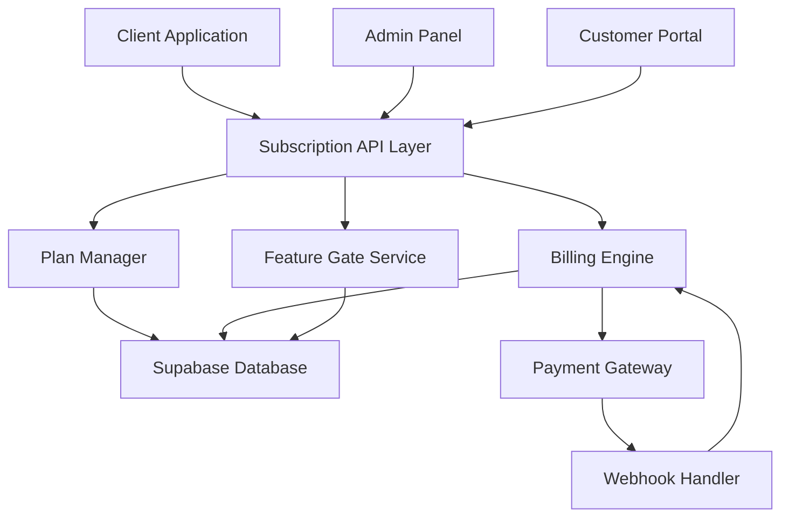
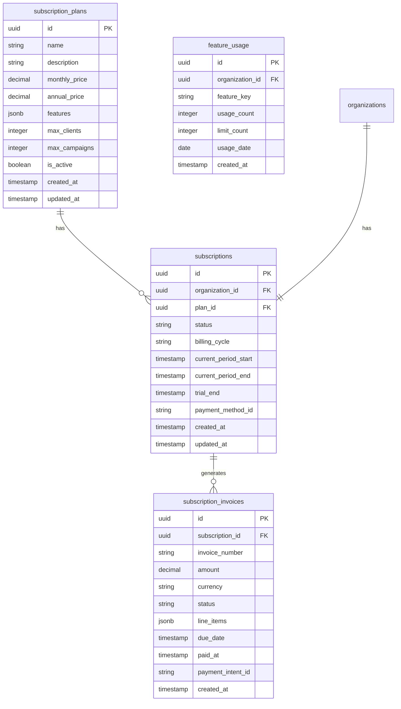

# Design Document

## Overview

The SaaS Subscription Plans system provides a complete subscription management solution with tiered pricing, automated billing, feature gating, and comprehensive analytics. The system integrates with existing authentication and organization management while adding subscription-based access control.

## Architecture

### System Components



### Database Schema Design



## Components and Interfaces

### 1. Plan Manager Service

**Purpose**: Manages subscription plans, features, and pricing logic.

**Key Methods**:
- `getAvailablePlans()`: Returns active subscription plans with features
- `createPlan(planData)`: Creates new subscription plan (admin only)
- `updatePlan(planId, updates)`: Updates existing plan
- `calculateUpgradeProration(currentPlan, newPlan)`: Calculates prorated costs

**Features Configuration**:
```typescript
interface PlanFeatures {
  maxClients: number;
  maxCampaigns: number;
  advancedAnalytics: boolean;
  customReports: boolean;
  apiAccess: boolean;
  whiteLabel: boolean;
  prioritySupport: boolean;
}
```

### 2. Billing Engine

**Purpose**: Handles automated billing, invoice generation, and payment processing.

**Key Methods**:
- `processRecurringBilling()`: Processes scheduled billing cycles
- `createInvoice(subscriptionId)`: Generates invoice for subscription
- `handlePaymentSuccess(paymentIntent)`: Processes successful payments
- `handlePaymentFailure(paymentIntent)`: Manages failed payment retry logic
- `calculateProration(subscription, newPlan)`: Calculates prorated amounts

**Payment Flow**:
1. Subscription creation triggers initial payment
2. Recurring billing runs daily to process due subscriptions
3. Payment webhooks update subscription and invoice status
4. Failed payments trigger retry sequence with customer notifications

### 3. Feature Gate Service

**Purpose**: Controls access to features based on subscription status and plan limits.

**Key Methods**:
- `checkFeatureAccess(orgId, feature)`: Validates feature access
- `checkUsageLimit(orgId, feature)`: Validates usage against limits
- `incrementUsage(orgId, feature)`: Tracks feature usage
- `getFeatureMatrix(planId)`: Returns available features for plan

**Implementation Strategy**:
- Middleware integration for API route protection
- React hooks for UI feature gating
- Real-time usage tracking and limit enforcement
- Graceful degradation when limits exceeded

### 4. Subscription Management API

**Endpoints**:
- `GET /api/subscriptions/plans` - List available plans
- `POST /api/subscriptions/create` - Create new subscription
- `PUT /api/subscriptions/upgrade` - Upgrade/downgrade plan
- `POST /api/subscriptions/cancel` - Cancel subscription
- `GET /api/subscriptions/billing-history` - Get billing history
- `POST /api/subscriptions/update-payment` - Update payment method

### 5. Admin Panel Integration

**Features**:
- Plan management interface
- Subscription analytics dashboard
- Customer subscription management
- Revenue reporting and metrics
- Failed payment monitoring

## Data Models

### Subscription Plans

```typescript
interface SubscriptionPlan {
  id: string;
  name: string;
  description: string;
  monthlyPrice: number;
  annualPrice: number;
  features: PlanFeatures;
  maxClients: number;
  maxCampaigns: number;
  isActive: boolean;
  createdAt: Date;
  updatedAt: Date;
}
```

### Subscription

```typescript
interface Subscription {
  id: string;
  organizationId: string;
  planId: string;
  status: 'active' | 'past_due' | 'canceled' | 'trialing';
  billingCycle: 'monthly' | 'annual';
  currentPeriodStart: Date;
  currentPeriodEnd: Date;
  trialEnd?: Date;
  paymentMethodId?: string;
  createdAt: Date;
  updatedAt: Date;
}
```

### Invoice

```typescript
interface SubscriptionInvoice {
  id: string;
  subscriptionId: string;
  invoiceNumber: string;
  amount: number;
  currency: string;
  status: 'draft' | 'open' | 'paid' | 'void' | 'uncollectible';
  lineItems: InvoiceLineItem[];
  dueDate: Date;
  paidAt?: Date;
  paymentIntentId?: string;
  createdAt: Date;
}
```

## Error Handling

### Payment Failures
- Implement exponential backoff retry logic
- Send customer notifications at each retry attempt
- Graceful downgrade to free tier after final failure
- Admin notifications for high-value customer failures

### Subscription State Management
- Handle edge cases like plan changes during billing cycles
- Manage prorations and credits accurately
- Ensure atomic operations for subscription updates
- Implement rollback mechanisms for failed operations

### Feature Gate Failures
- Fail open for critical business features
- Provide clear upgrade messaging for blocked features
- Cache feature access decisions for performance
- Handle temporary service outages gracefully

## Testing Strategy

### Unit Tests
- Plan calculation logic (prorations, upgrades)
- Feature gate access control
- Billing cycle calculations
- Invoice generation logic

### Integration Tests
- Payment gateway integration
- Webhook processing
- Database transaction integrity
- Email notification delivery

### End-to-End Tests
- Complete subscription signup flow
- Plan upgrade/downgrade scenarios
- Payment failure and recovery
- Feature access enforcement

### Performance Tests
- Feature gate response times
- Billing processing at scale
- Database query optimization
- API endpoint load testing

## Security Considerations

### Payment Data
- Never store sensitive payment information
- Use payment gateway tokens for recurring billing
- Implement PCI compliance requirements
- Encrypt all financial data in transit and at rest

### Access Control
- Validate organization membership for all subscription operations
- Implement rate limiting on subscription API endpoints
- Audit all subscription and billing changes
- Secure webhook endpoints with signature verification

### Data Privacy
- Comply with GDPR for customer billing data
- Implement data retention policies for invoices
- Provide customer data export capabilities
- Secure deletion of canceled subscription data

## Monitoring and Analytics

### Key Metrics
- Monthly Recurring Revenue (MRR)
- Annual Recurring Revenue (ARR)
- Customer Churn Rate
- Conversion Rate (trial to paid)
- Customer Lifetime Value (CLV)
- Payment Success Rate

### Alerting
- Failed payment notifications
- Subscription cancellation alerts
- Revenue threshold monitoring
- System health checks for billing processes

### Reporting
- Real-time subscription dashboard
- Monthly revenue reports
- Customer cohort analysis
- Feature usage analytics
- Payment gateway performance metrics