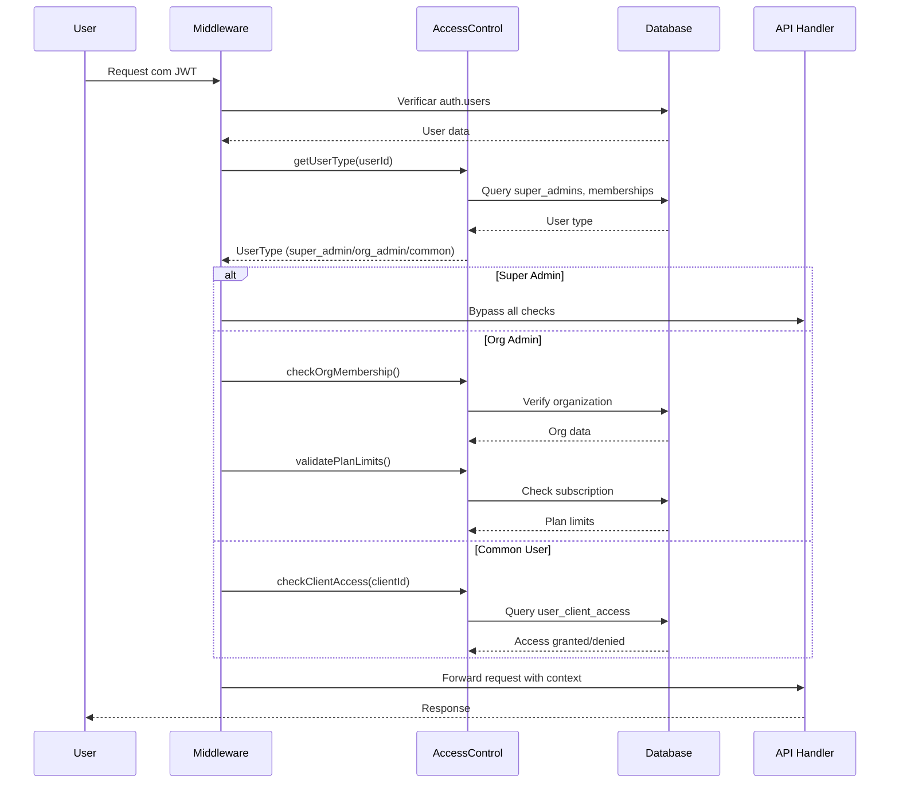

# Design Document - Sistema de Controle de Acesso Hierárquico

## Overview

Este documento descreve o design de um sistema de controle de acesso hierárquico com três níveis distintos de usuários: Super Admin (acesso total sem limites), Admin de Organização (gerencia usuários e clientes dentro do plano contratado) e Usuário Comum (acesso restrito aos clientes autorizados).

O sistema implementa:
- Hierarquia clara de permissões entre os três tipos de usuário
- CRUD completo de usuários gerenciado por admins de organização
- Controle granular de acesso aos clientes do portfólio
- Validação de limites de plano para admins de organização
- Middleware centralizado para controle de acesso em APIs

## Architecture

### Camadas do Sistema

```
┌─────────────────────────────────────────────────────────────┐
│                    Presentation Layer                        │
│  ┌──────────────┐  ┌──────────────┐  ┌──────────────┐      │
│  │ Super Admin  │  │ Org Admin    │  │ Common User  │      │
│  │ Dashboard    │  │ Dashboard    │  │ Dashboard    │      │
│  └──────────────┘  └──────────────┘  └──────────────┘      │
└─────────────────────────────────────────────────────────────┘
                            │
┌─────────────────────────────────────────────────────────────┐
│                    API Layer (Next.js)                       │
│  ┌──────────────────────────────────────────────────────┐   │
│  │         User Access Middleware                       │   │
│  │  - Autenticação                                      │   │
│  │  - Validação de tipo de usuário                     │   │
│  │  - Verificação de permissões                        │   │
│  └──────────────────────────────────────────────────────┘   │
│                            │                                 │
│  ┌──────────────┐  ┌──────────────┐  ┌──────────────┐      │
│  │ User Mgmt    │  │ Client       │  │ Campaign     │      │
│  │ APIs         │  │ Access APIs  │  │ APIs         │      │
│  └──────────────┘  └──────────────┘  └──────────────┘      │
└─────────────────────────────────────────────────────────────┘
                            │
┌─────────────────────────────────────────────────────────────┐
│                    Service Layer                             │
│  ┌──────────────────────────────────────────────────────┐   │
│  │         UserAccessControlService                     │   │
│  │  - getUserType()                                     │   │
│  │  - checkPermissions()                                │   │
│  │  - validatePlanLimits()                              │   │
│  └──────────────────────────────────────────────────────┘   │
│  ┌──────────────────────────────────────────────────────┐   │
│  │         UserManagementService                        │   │
│  │  - createUser()                                      │   │
│  │  - updateUser()                                      │   │
│  │  - deleteUser()                                      │   │
│  │  - assignClientAccess()                              │   │
│  └──────────────────────────────────────────────────────┘   │
└─────────────────────────────────────────────────────────────┘
                            │
┌─────────────────────────────────────────────────────────────┐
│                    Database Layer (Supabase)                 │
│  ┌──────────────┐  ┌──────────────┐  ┌──────────────┐      │
│  │ auth.users   │  │ memberships  │  │ clients      │      │
│  └──────────────┘  └──────────────┘  └──────────────┘      │
│  ┌──────────────┐  ┌──────────────┐  ┌──────────────┐      │
│  │ super_admins │  │ user_client  │  │ subscriptions│      │
│  │              │  │ _access      │  │              │      │
│  └──────────────┘  └──────────────┘  └──────────────┘      │
│                                                              │
│  RLS Policies: Isolamento por organização e cliente         │
└─────────────────────────────────────────────────────────────┘
```

### Fluxo de Autenticação e Autorização



## Components and Interfaces

### 1. Database Schema

#### Tabela: super_admins
```sql
CREATE TABLE super_admins (
    id UUID PRIMARY KEY DEFAULT uuid_generate_v4(),
    user_id UUID NOT NULL REFERENCES auth.users(id) ON DELETE CASCADE,
    created_by UUID REFERENCES auth.users(id),
    created_at TIMESTAMPTZ DEFAULT NOW(),
    updated_at TIMESTAMPTZ DEFAULT NOW(),
    is_active BOOLEAN DEFAULT true,
    notes TEXT,
    UNIQUE(user_id)
);
```

**Propósito**: Identifica usuários com acesso total ao sistema, sem restrições de organização ou plano.

#### Tabela: memberships (atualizada)
```sql
ALTER TABLE memberships 
ADD COLUMN IF NOT EXISTS role VARCHAR(50) DEFAULT 'member';
-- Valores: 'admin', 'member'
```

**Propósito**: Define o papel do usuário dentro da organização. Admins podem gerenciar usuários e clientes.

#### Tabela: user_client_access
```sql
CREATE TABLE user_client_access (
    id UUID PRIMARY KEY DEFAULT uuid_generate_v4(),
    user_id UUID NOT NULL REFERENCES auth.users(id) ON DELETE CASCADE,
    client_id UUID NOT NULL REFERENCES clients(id) ON DELETE CASCADE,
    organization_id UUID NOT NULL REFERENCES organizations(id) ON DELETE CASCADE,
    granted_by UUID NOT NULL REFERENCES auth.users(id),
    created_at TIMESTAMPTZ DEFAULT NOW(),
    updated_at TIMESTAMPTZ DEFAULT NOW(),
    is_active BOOLEAN DEFAULT true,
    permissions JSONB DEFAULT '{"read": true, "write": false}'::jsonb,
    notes TEXT,
    UNIQUE(user_id, client_id),
    -- Constraint: user e client devem pertencer à mesma org
    CONSTRAINT same_org_check CHECK (
        (SELECT org_id FROM clients WHERE id = client_id) = organization_id
    )
);
```

**Propósito**: Controla quais clientes cada usuário comum pode acessar.

### 2. Service Layer

#### UserAccessControlService

```typescript
interface UserAccessControlService {
  // Identificação de tipo de usuário
  getUserType(userId: string): Promise<UserType>
  isSuperAdmin(userId: string): Promise<boolean>
  isOrgAdmin(userId: string, orgId: string): Promise<boolean>
  
  // Verificação de permissões
  checkPermission(
    userId: string,
    resource: ResourceType,
    action: Action,
    resourceId?: string
  ): Promise<PermissionResult>
  
  // Acesso a clientes
  getUserAccessibleClients(userId: string): Promise<Client[]>
  hasClientAccess(userId: string, clientId: string): Promise<boolean>
  
  // Limites de plano
  getOrganizationLimits(orgId: string): Promise<PlanLimits>
  validateActionAgainstLimits(
    orgId: string,
    action: LimitedAction
  ): Promise<ValidationResult>
}
```

#### UserManagementService

```typescript
interface UserManagementService {
  // CRUD de usuários (apenas para admins)
  createUser(
    adminUserId: string,
    userData: CreateUserData
  ): Promise<User>
  
  updateUser(
    adminUserId: string,
    userId: string,
    updates: UpdateUserData
  ): Promise<User>
  
  deleteUser(
    adminUserId: string,
    userId: string
  ): Promise<void>
  
  listOrganizationUsers(
    adminUserId: string,
    orgId: string
  ): Promise<User[]>
  
  // Gerenciamento de acesso a clientes
  grantClientAccess(
    adminUserId: string,
    userId: string,
    clientId: string,
    permissions?: Permissions
  ): Promise<void>
  
  revokeClientAccess(
    adminUserId: string,
    userId: string,
    clientId: string
  ): Promise<void>
  
  listUserClientAccess(
    adminUserId: string,
    userId: string
  ): Promise<ClientAccess[]>
}
```

### 3. API Endpoints

#### User Management APIs

```typescript
// POST /api/admin/users
// Criar novo usuário (apenas org admin ou super admin)
interface CreateUserRequest {
  email: string
  name: string
  role: 'admin' | 'member'
  organizationId: string // Opcional para super admin
}

// PUT /api/admin/users/[userId]
// Atualizar usuário
interface UpdateUserRequest {
  name?: string
  role?: 'admin' | 'member'
  isActive?: boolean
}

// DELETE /api/admin/users/[userId]
// Deletar usuário

// GET /api/admin/users
// Listar usuários da organização
interface ListUsersQuery {
  organizationId?: string // Obrigatório para org admin
  role?: 'admin' | 'member'
  isActive?: boolean
}
```

#### Client Access APIs

```typescript
// POST /api/admin/user-client-access
// Conceder acesso a cliente
interface GrantAccessRequest {
  userId: string
  clientId: string
  permissions?: {
    read: boolean
    write: boolean
  }
}

// DELETE /api/admin/user-client-access
// Revogar acesso
interface RevokeAccessRequest {
  userId: string
  clientId: string
}

// GET /api/admin/user-client-access/[userId]
// Listar acessos do usuário
interface UserAccessResponse {
  userId: string
  accesses: Array<{
    clientId: string
    clientName: string
    permissions: Permissions
    grantedAt: string
    grantedBy: string
  }>
}
```

### 4. Middleware Layer

#### Access Control Middleware

```typescript
interface AccessControlMiddleware {
  // Verificar tipo de usuário
  requireSuperAdmin(): MiddlewareFunction
  requireOrgAdmin(): MiddlewareFunction
  requireAnyAdmin(): MiddlewareFunction
  
  // Verificar acesso a recursos
  requireClientAccess(clientId: string): MiddlewareFunction
  requireOrganizationMembership(orgId: string): MiddlewareFunction
  
  // Validar limites de plano
  validatePlanLimit(action: LimitedAction): MiddlewareFunction
}
```

## Data Models

### UserType Enum
```typescript
enum UserType {
  SUPER_ADMIN = 'super_admin',
  ORG_ADMIN = 'org_admin',
  COMMON_USER = 'common_user'
}
```

### User Model
```typescript
interface User {
  id: string
  email: string
  name: string
  userType: UserType
  organizations: Array<{
    id: string
    name: string
    role: 'admin' | 'member'
  }>
  createdAt: Date
  updatedAt: Date
  isActive: boolean
}
```

### ClientAccess Model
```typescript
interface ClientAccess {
  id: string
  userId: string
  clientId: string
  organizationId: string
  permissions: {
    read: boolean
    write: boolean
  }
  grantedBy: string
  grantedAt: Date
  isActive: boolean
}
```

### PlanLimits Model
```typescript
interface PlanLimits {
  maxUsers: number | null // null = unlimited
  maxClients: number | null
  maxConnections: number | null
  maxCampaigns: number | null
  currentUsage: {
    users: number
    clients: number
    connections: number
    campaigns: number
  }
}
```

## Correctness Properties

*A property is a characteristic or behavior that should hold true across all valid executions of a system-essentially, a formal statement about what the system should do. Properties serve as the bridge between human-readable specifications and machine-verifiable correctness guarantees.*

### Property 1: Super Admin Universal Access
*For any* super admin user, any resource type (users, clients, connections, campaigns), and any organization, the access control system should grant full access without checking subscription status or organization membership.

**Reasoning**: Super admins need unrestricted access to manage the entire system. This property combines the requirements that super admins bypass all checks (subscription, organization, limits) into a single comprehensive test. We can generate random super admin users and random resources across different organizations, then verify access is always granted without any validation checks.

**Validates: Requirements 1.1, 1.2, 1.3, 1.5**

### Property 2: Organization Boundary Enforcement
*For any* organization admin and any user management operation (view, create, update, delete), the system should only allow the operation if the target user belongs to the same organization as the admin.

**Reasoning**: Organization admins must be isolated to their own organization's users. This property tests that cross-organization operations are blocked. We can generate random org admins and users from different organizations, attempt operations, and verify that only same-org operations succeed.

**Validates: Requirements 2.1, 2.3, 2.5**

### Property 3: User Creation Membership Consistency
*For any* organization admin creating a new user, the system should create exactly one membership record linking the new user to the admin's organization with the specified role.

**Reasoning**: User creation must properly establish organization membership. We can generate random user creation requests and verify that: (1) a membership record is created, (2) it links to the correct organization, (3) it has the correct role, and (4) only one membership is created.

**Validates: Requirements 2.2**

### Property 4: User Deletion Cascade Cleanup
*For any* user deletion, all associated records (memberships, client access grants) should be automatically removed or marked inactive.

**Reasoning**: Deleting a user must clean up all related data to maintain referential integrity. We can create users with various associated records, delete them, and verify all related records are cleaned up.

**Validates: Requirements 2.4, 3.5**

### Property 5: Client Access Authorization
*For any* common user and any client-specific resource (campaigns, reports, insights), the system should grant access if and only if there exists an active user_client_access record linking that user to that client.

**Reasoning**: Common users should only access explicitly authorized clients. This property tests the core access control mechanism. We can generate random users and clients, with and without access grants, and verify access matches the presence of active access records.

**Validates: Requirements 5.1, 5.2, 5.3, 5.4, 6.5**

### Property 6: Common User Creation Restriction
*For any* common user (non-admin) and any creation attempt (clients, connections), the system should reject the request with a permission denied error, regardless of other permissions or client access.

**Reasoning**: Common users must not be able to create structural elements of the portfolio. We can generate random common users with various client access permissions and verify that all creation attempts are rejected.

**Validates: Requirements 6.2, 6.4**

### Property 7: Access Grant Same-Organization Constraint
*For any* client access grant attempt, if the user and client do not belong to the same organization, the system should reject the grant with a validation error.

**Reasoning**: Access grants must respect organization boundaries. We can generate random combinations of users and clients from different organizations and verify that cross-org grants are rejected.

**Validates: Requirements 10.2**

### Property 8: Access Revocation Immediacy
*For any* active client access grant, immediately after revocation (marking inactive or deleting), any access attempt by that user to that client should be denied.

**Reasoning**: Permission changes must take effect immediately without caching delays. We can grant access, verify it works, revoke it, and immediately verify access is denied.

**Validates: Requirements 3.3, 5.5**

### Property 9: Multiple Client Access Assignment
*For any* user and any set of clients within the same organization, the system should allow creating multiple distinct access grants, one for each client.

**Reasoning**: Users should be able to access multiple clients simultaneously. We can generate random users and multiple clients, create access grants for each, and verify all grants exist and function independently.

**Validates: Requirements 3.4**

### Property 10: Plan Limit Enforcement
*For any* organization at or above its plan limit for a resource type (users, clients, connections), any creation attempt for that resource type should be rejected with a plan limit error, unless performed by a super admin.

**Reasoning**: Plan limits must be enforced to control resource usage. We can generate organizations at various usage levels, attempt creations, and verify that at-limit orgs are blocked while under-limit orgs succeed. Super admins should bypass these checks.

**Validates: Requirements 4.1, 4.2, 4.3, 4.4**

### Property 11: Subscription Expiration Restriction
*For any* organization with an expired or inactive subscription, any resource creation attempt by an organization admin should be rejected, while read operations remain allowed.

**Reasoning**: Expired subscriptions should block new resource creation but allow viewing existing data. We can generate orgs with expired subscriptions and verify creation is blocked while reads succeed.

**Validates: Requirements 4.4**

### Property 12: Super Admin Cross-Organization Management
*For any* super admin, any user in any organization, and any management operation (create, update, delete, assign access), the system should allow the operation regardless of organization boundaries.

**Reasoning**: Super admins need to manage users across all organizations for support and administration. We can generate super admins performing operations on users from various organizations and verify all operations succeed.

**Validates: Requirements 7.1, 7.2, 7.3, 7.4**

### Property 13: Membership Uniqueness
*For any* user and organization pair, attempting to create a second active membership should be rejected with a duplicate error.

**Reasoning**: Each user should have at most one membership per organization to avoid ambiguity. We can create a membership, then attempt to create a duplicate, and verify the second attempt fails.

**Validates: Requirements 10.3**

### Property 14: Organization Validation on User Creation
*For any* user creation attempt, if the specified organization does not exist or is inactive, the system should reject the creation with a validation error.

**Reasoning**: Users must be created within valid, active organizations. We can generate creation attempts with invalid or inactive organization IDs and verify they're rejected.

**Validates: Requirements 10.1**

### Property 15: Permission Check on All API Requests
*For any* API endpoint and any authenticated user, the system should perform a permission check before processing the request, and the check result should determine whether the request proceeds or is rejected.

**Reasoning**: All API endpoints must enforce access control consistently. We can generate random API requests from users with various permission levels and verify that permission checks occur and are enforced correctly.

**Validates: Requirements 8.2**

## Error Handling

### Error Types

```typescript
enum AccessControlError {
  UNAUTHORIZED = 'UNAUTHORIZED',
  FORBIDDEN = 'FORBIDDEN',
  PLAN_LIMIT_EXCEEDED = 'PLAN_LIMIT_EXCEEDED',
  INVALID_ORGANIZATION = 'INVALID_ORGANIZATION',
  CLIENT_ACCESS_DENIED = 'CLIENT_ACCESS_DENIED',
  USER_NOT_FOUND = 'USER_NOT_FOUND',
  DUPLICATE_MEMBERSHIP = 'DUPLICATE_MEMBERSHIP',
  SAME_ORG_VIOLATION = 'SAME_ORG_VIOLATION'
}
```

### Error Response Format

```typescript
interface ErrorResponse {
  error: {
    code: AccessControlError
    message: string
    details?: {
      userType?: UserType
      requiredPermission?: string
      currentLimit?: number
      attemptedAction?: string
    }
  }
}
```

### Error Handling Strategy

1. **Authentication Errors (401)**
   - Token inválido ou expirado
   - Usuário não encontrado
   - Retornar mensagem genérica para segurança

2. **Authorization Errors (403)**
   - Tipo de usuário inadequado
   - Falta de permissão específica
   - Acesso a cliente não autorizado
   - Retornar mensagem específica com contexto

3. **Plan Limit Errors (402)**
   - Limite de usuários atingido
   - Limite de clientes atingido
   - Limite de conexões atingido
   - Retornar limites atuais e sugestão de upgrade

4. **Validation Errors (400)**
   - Dados inválidos
   - Violação de constraint (mesma organização)
   - Membership duplicado
   - Retornar detalhes da validação falhada

## Testing Strategy

### Unit Tests

**Foco**: Testar funções individuais de serviços e utilitários

**Exemplos**:
- `getUserType()` retorna tipo correto para cada cenário
- `validatePlanLimits()` calcula limites corretamente
- `checkClientAccess()` verifica acesso corretamente
- Funções de validação de dados

**Ferramentas**: Jest, @testing-library/react

### Property-Based Tests

**Biblioteca**: fast-check (JavaScript/TypeScript)

**Configuração**: Mínimo 100 iterações por propriedade

**Propriedades a Testar**:

1. **Property 1: Super Admin Bypass**
   - Gerar: usuário super admin aleatório, recurso aleatório
   - Verificar: acesso sempre concedido

2. **Property 2: Organization Isolation**
   - Gerar: org admin aleatório, usuário de org diferente
   - Verificar: operação negada

3. **Property 3: Client Access Enforcement**
   - Gerar: usuário comum aleatório, cliente aleatório
   - Verificar: acesso = existe registro ativo em user_client_access

4. **Property 4: Creation Permission Restriction**
   - Gerar: usuário comum aleatório, tentativa de criação
   - Verificar: sempre negado

5. **Property 5: Plan Limit Enforcement**
   - Gerar: org no limite, tentativa de criação
   - Verificar: negado com erro de limite

6. **Property 6: Access Revocation Immediacy**
   - Gerar: acesso existente, revogar, tentar acessar
   - Verificar: acesso negado imediatamente

7. **Property 7: User Deletion Cascade**
   - Gerar: usuário com acessos, deletar usuário
   - Verificar: todos acessos removidos

8. **Property 8: Same Organization Constraint**
   - Gerar: usuário de org A, cliente de org B
   - Verificar: grant access falha

9. **Property 9: Role-Based CRUD Access**
   - Gerar: usuário sem role admin, operação CRUD
   - Verificar: operação negada

10. **Property 10: Membership Uniqueness**
    - Gerar: mesmo usuário e org, tentar criar duplicado
    - Verificar: falha com erro de duplicação

### Integration Tests

**Foco**: Testar fluxos completos através de múltiplas camadas

**Cenários**:
- Fluxo completo de criação de usuário por admin
- Fluxo de concessão e revogação de acesso a cliente
- Fluxo de validação de limites de plano
- Fluxo de autenticação e autorização em APIs

**Ferramentas**: Playwright, Supertest

### End-to-End Tests

**Foco**: Testar experiência completa do usuário

**Cenários**:
- Super admin gerencia múltiplas organizações
- Org admin cria usuários e atribui acessos
- Usuário comum acessa apenas clientes autorizados
- Tentativas de acesso não autorizado são bloqueadas

**Ferramentas**: Playwright

## Security Considerations

### 1. Row Level Security (RLS)

Todas as tabelas devem ter RLS habilitado com políticas específicas:

```sql
-- super_admins: apenas super admins podem ver/modificar
CREATE POLICY "super_admins_self_manage"
  ON super_admins
  FOR ALL
  USING (
    user_id = auth.uid() OR
    EXISTS (SELECT 1 FROM super_admins WHERE user_id = auth.uid() AND is_active = true)
  );

-- user_client_access: usuários veem apenas seus próprios acessos
CREATE POLICY "user_client_access_self_read"
  ON user_client_access
  FOR SELECT
  USING (user_id = auth.uid());

-- user_client_access: apenas admins da org podem gerenciar
CREATE POLICY "user_client_access_admin_manage"
  ON user_client_access
  FOR ALL
  USING (
    EXISTS (
      SELECT 1 FROM memberships m
      WHERE m.user_id = auth.uid()
      AND m.organization_id = user_client_access.organization_id
      AND m.role = 'admin'
    ) OR
    EXISTS (SELECT 1 FROM super_admins WHERE user_id = auth.uid() AND is_active = true)
  );
```

### 2. API Security

- Todos os endpoints devem validar JWT token
- Middleware deve verificar tipo de usuário antes de processar
- Logs de auditoria para todas as operações sensíveis
- Rate limiting por tipo de usuário

### 3. Data Validation

- Validar que usuário e cliente pertencem à mesma org
- Validar unicidade de memberships
- Validar limites de plano antes de criar recursos
- Sanitizar inputs para prevenir SQL injection

### 4. Sensitive Data

- Não expor IDs internos desnecessariamente
- Não retornar dados de outras organizações
- Logs não devem conter informações sensíveis
- Implementar data masking quando apropriado

## Performance Considerations

### 1. Database Indexes

```sql
-- Índices para performance de queries comuns
CREATE INDEX idx_super_admins_user_id ON super_admins(user_id) WHERE is_active = true;
CREATE INDEX idx_user_client_access_user_id ON user_client_access(user_id) WHERE is_active = true;
CREATE INDEX idx_user_client_access_client_id ON user_client_access(client_id) WHERE is_active = true;
CREATE INDEX idx_memberships_user_org ON memberships(user_id, organization_id);
CREATE INDEX idx_memberships_role ON memberships(role) WHERE role = 'admin';
```

### 2. Caching Strategy

- Cache de tipo de usuário (TTL: 5 minutos)
- Cache de limites de plano (TTL: 10 minutos)
- Cache de client access list (TTL: 2 minutos)
- Invalidar cache ao modificar permissões

### 3. Query Optimization

- Usar JOINs eficientes para verificar permissões
- Evitar N+1 queries ao listar usuários com acessos
- Usar EXISTS ao invés de COUNT quando possível
- Implementar paginação para listagens grandes

## Deployment Considerations

### 1. Migration Strategy

1. Criar tabelas novas (super_admins, user_client_access)
2. Adicionar coluna role em memberships
3. Migrar dados existentes se necessário
4. Aplicar RLS policies
5. Criar índices
6. Testar em staging
7. Deploy em produção com rollback plan

### 2. Rollback Plan

- Manter backup do schema anterior
- Script de rollback para remover novas tabelas
- Plano de comunicação com usuários
- Monitoramento de erros pós-deploy

### 3. Monitoring

- Métricas de acesso negado por tipo
- Latência de verificação de permissões
- Taxa de erro em operações de usuário
- Uso de limites de plano por organização

## Future Enhancements

1. **Permissões Granulares**
   - Permissões por tipo de campanha
   - Permissões por ação específica (edit, delete, etc)
   - Permissões temporárias com expiração

2. **Audit Log Avançado**
   - Histórico completo de mudanças de permissão
   - Relatórios de acesso por usuário
   - Alertas de atividade suspeita

3. **Self-Service**
   - Usuários podem solicitar acesso a clientes
   - Workflow de aprovação para admins
   - Notificações de mudanças de acesso

4. **API Keys**
   - Suporte a API keys para integrações
   - Controle de acesso por API key
   - Rate limiting por API key
