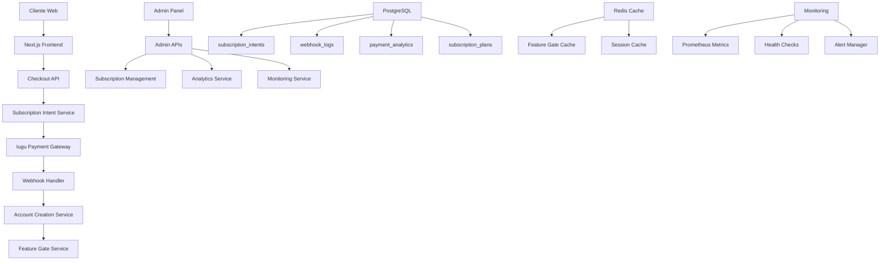
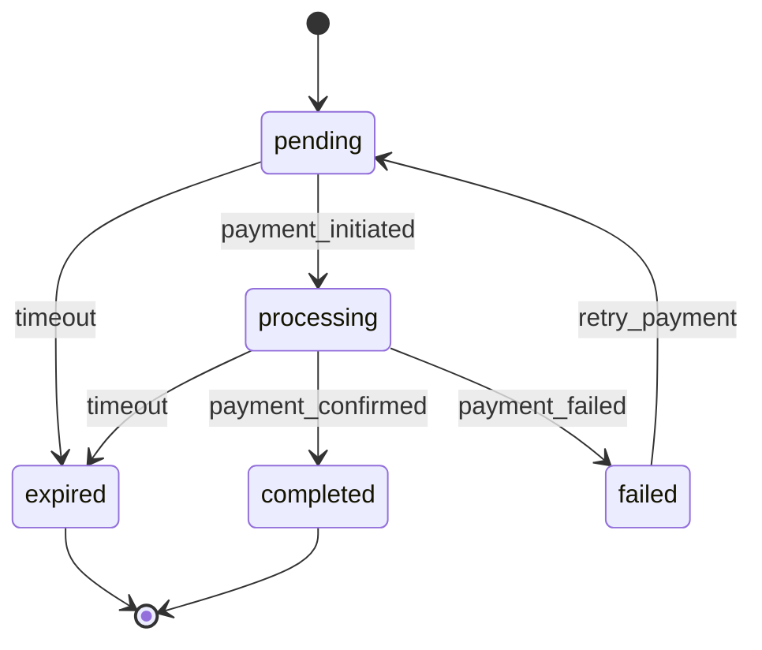

# Sistema de Checkout e Pagamentos - Visão Geral Técnica

## Introdução

O Sistema de Checkout e Pagamentos é uma solução completa para processamento de assinaturas SaaS, integrando com o gateway de pagamento Iugu. O sistema foi projetado com foco em confiabilidade, observabilidade e experiência do usuário.

## Arquitetura Geral

### Componentes Principais



### Stack Tecnológico

- **Frontend**: Next.js 15.3.4, React 19, TypeScript
- **Backend**: Next.js API Routes, Node.js
- **Banco de Dados**: PostgreSQL com Supabase
- **Cache**: Redis (para feature gates e sessões)
- **Gateway de Pagamento**: Iugu API
- **Monitoramento**: Prometheus, Grafana, AlertManager
- **Autenticação**: Supabase Auth
- **Segurança**: Row Level Security (RLS), JWT

## Fluxo de Checkout

### 1. Iniciação do Checkout

```typescript
// Fluxo simplificado
POST /api/subscriptions/checkout-iugu
{
  "plan_id": "uuid",
  "billing_cycle": "monthly|annual",
  "user_email": "email@exemplo.com",
  "user_name": "Nome Completo",
  "organization_name": "Empresa ABC",
  "cpf_cnpj": "12345678901",
  "phone": "+5511999999999"
}

// Resposta
{
  "success": true,
  "intent_id": "uuid",
  "checkout_url": "https://iugu.com/checkout/...",
  "status_url": "/checkout/status/uuid",
  "expires_at": "2024-01-15T23:59:59Z"
}
```

### 2. Estados da Subscription Intent



### 3. Processamento de Webhook

```typescript
// Webhook do Iugu
POST /api/webhooks/iugu
{
  "event": "invoice.status_changed",
  "data": {
    "id": "invoice_id",
    "status": "paid",
    "subscription_id": "sub_id"
  }
}

// Processamento interno
1. Validação de assinatura
2. Deduplicação por event_id
3. Atualização do subscription_intent
4. Criação automática de conta (se necessário)
5. Ativação de feature gates
6. Envio de email de boas-vindas
```

## Serviços Principais

### Subscription Intent Service

Gerencia o ciclo de vida das intenções de assinatura:

```typescript
interface SubscriptionIntentService {
  create(data: CreateIntentRequest): Promise<SubscriptionIntent>;
  updateStatus(id: string, status: IntentStatus): Promise<void>;
  expire(id: string): Promise<void>;
  retry(id: string): Promise<SubscriptionIntent>;
  cancel(id: string, reason: string): Promise<void>;
}
```

**Funcionalidades:**
- Criação e validação de intents
- Gerenciamento de estados com state machine
- Expiração automática via cron jobs
- Retry logic para falhas temporárias
- Auditoria completa de transições

### Webhook Processor

Processa eventos do Iugu de forma confiável:

```typescript
interface WebhookProcessor {
  process(event: WebhookEvent): Promise<ProcessingResult>;
  retry(eventId: string): Promise<void>;
  markAsDeadLetter(eventId: string): Promise<void>;
}
```

**Funcionalidades:**
- Validação de assinatura HMAC
- Deduplicação de eventos
- Retry exponencial com circuit breaker
- Dead letter queue para eventos não processáveis
- Logs detalhados para auditoria

### Account Creation Service

Cria contas automaticamente após confirmação de pagamento:

```typescript
interface AccountCreationService {
  createFromIntent(intentId: string): Promise<AccountCreationResult>;
  sendWelcomeEmail(userId: string): Promise<void>;
  setupOrganization(userId: string, orgName: string): Promise<Organization>;
}
```

**Funcionalidades:**
- Criação de usuário no Supabase Auth
- Setup de organização e membership
- Configuração de feature gates
- Envio de emails de boas-vindas
- Geração de senha temporária

### Feature Gate Service

Controla acesso baseado em planos de assinatura:

```typescript
interface FeatureGateService {
  checkAccess(orgId: string, feature: string): Promise<boolean>;
  getUsageLimits(orgId: string): Promise<UsageLimits>;
  incrementUsage(orgId: string, feature: string): Promise<void>;
  invalidateCache(orgId: string): Promise<void>;
}
```

**Funcionalidades:**
- Cache Redis para performance
- Verificação em tempo real de limites
- Controle granular por feature
- Graceful degradation em falhas
- Métricas de uso detalhadas

## Banco de Dados

### Schema Principal

#### subscription_intents
Tabela central para intenções de assinatura:

```sql
CREATE TABLE subscription_intents (
  id UUID PRIMARY KEY DEFAULT uuid_generate_v4(),
  plan_id UUID NOT NULL REFERENCES subscription_plans(id),
  billing_cycle VARCHAR(10) NOT NULL,
  status VARCHAR(20) NOT NULL DEFAULT 'pending',
  user_email VARCHAR(255) NOT NULL,
  user_name VARCHAR(255) NOT NULL,
  organization_name VARCHAR(255) NOT NULL,
  cpf_cnpj VARCHAR(20),
  phone VARCHAR(20),
  iugu_customer_id VARCHAR(255),
  iugu_subscription_id VARCHAR(255),
  checkout_url TEXT,
  user_id UUID REFERENCES auth.users(id),
  metadata JSONB DEFAULT '{}',
  expires_at TIMESTAMP WITH TIME ZONE,
  completed_at TIMESTAMP WITH TIME ZONE,
  created_at TIMESTAMP WITH TIME ZONE DEFAULT NOW(),
  updated_at TIMESTAMP WITH TIME ZONE DEFAULT NOW()
);
```

#### webhook_logs
Auditoria completa de webhooks:

```sql
CREATE TABLE webhook_logs (
  id UUID PRIMARY KEY DEFAULT uuid_generate_v4(),
  event_type VARCHAR(100) NOT NULL,
  event_id VARCHAR(255),
  subscription_intent_id UUID REFERENCES subscription_intents(id),
  payload JSONB NOT NULL,
  status VARCHAR(20) NOT NULL DEFAULT 'received',
  processed_at TIMESTAMP WITH TIME ZONE,
  error_message TEXT,
  retry_count INTEGER DEFAULT 0,
  created_at TIMESTAMP WITH TIME ZONE DEFAULT NOW()
);
```

#### payment_analytics
Métricas agregadas para business intelligence:

```sql
CREATE TABLE payment_analytics (
  id UUID PRIMARY KEY DEFAULT uuid_generate_v4(),
  date DATE NOT NULL,
  plan_id UUID REFERENCES subscription_plans(id),
  checkouts_started INTEGER DEFAULT 0,
  checkouts_completed INTEGER DEFAULT 0,
  payments_confirmed INTEGER DEFAULT 0,
  revenue_total DECIMAL(10,2) DEFAULT 0,
  avg_completion_time_minutes INTEGER DEFAULT 0,
  created_at TIMESTAMP WITH TIME ZONE DEFAULT NOW(),
  UNIQUE(date, plan_id)
);
```

### Índices de Performance

```sql
-- Índices críticos para performance
CREATE INDEX idx_subscription_intents_status ON subscription_intents(status);
CREATE INDEX idx_subscription_intents_user_email ON subscription_intents(user_email);
CREATE INDEX idx_subscription_intents_expires_at ON subscription_intents(expires_at);
CREATE INDEX idx_webhook_logs_event_type ON webhook_logs(event_type);
CREATE INDEX idx_webhook_logs_status ON webhook_logs(status);
CREATE UNIQUE INDEX idx_webhook_logs_dedup ON webhook_logs(event_id, source);
```

### Row Level Security (RLS)

```sql
-- Políticas de segurança
ALTER TABLE subscription_intents ENABLE ROW LEVEL SECURITY;

CREATE POLICY "Users can view own intents" ON subscription_intents
  FOR SELECT USING (auth.uid() = user_id OR user_email = auth.jwt() ->> 'email');

CREATE POLICY "Admins can view all intents" ON subscription_intents
  FOR ALL USING (auth.jwt() ->> 'role' = 'admin');
```

## APIs Principais

### Checkout API

```typescript
// POST /api/subscriptions/checkout-iugu
interface CheckoutAPI {
  create(request: CheckoutRequest): Promise<CheckoutResponse>;
  validate(data: CheckoutRequest): ValidationResult;
  createIuguCustomer(userData: UserData): Promise<IuguCustomer>;
  createIuguSubscription(customerId: string, planId: string): Promise<IuguSubscription>;
}
```

### Status API

```typescript
// GET /api/subscriptions/status/[intentId]
interface StatusAPI {
  getStatus(intentId: string): Promise<StatusResponse>;
  getPublicStatus(email: string): Promise<PublicStatusResponse>;
  streamStatus(intentId: string): WebSocketStream;
}
```

### Recovery API

```typescript
// POST /api/subscriptions/recovery/*
interface RecoveryAPI {
  regeneratePayment(intentId: string): Promise<RegenerateResponse>;
  resendEmail(intentId: string, type: EmailType): Promise<void>;
  cancelIntent(intentId: string, reason: string): Promise<void>;
}
```

### Admin API

```typescript
// /api/admin/subscription-intents/*
interface AdminAPI {
  listIntents(filters: IntentFilters): Promise<PaginatedIntents>;
  getIntentDetails(intentId: string): Promise<DetailedIntent>;
  manualActivation(intentId: string): Promise<ActivationResult>;
  exportData(filters: ExportFilters): Promise<ExportJob>;
}
```

## Monitoramento e Observabilidade

### Métricas Prometheus

```typescript
// Métricas coletadas
const metrics = {
  checkout_requests_total: Counter,
  checkout_duration_seconds: Histogram,
  checkout_success_rate: Gauge,
  webhook_processing_duration: Histogram,
  webhook_retry_count: Counter,
  payment_confirmation_delay: Histogram,
  account_creation_success_rate: Gauge,
  feature_gate_cache_hit_rate: Gauge
};
```

### Health Checks

```typescript
// GET /api/health/*
interface HealthChecks {
  overall(): Promise<HealthStatus>;
  checkout(): Promise<ComponentHealth>;
  iugu(): Promise<ComponentHealth>;
  database(): Promise<ComponentHealth>;
  dependencies(): Promise<DependenciesHealth>;
}
```

### Alertas Automáticos

```yaml
# Regras de alerta
groups:
  - name: checkout_alerts
    rules:
      - alert: HighCheckoutFailureRate
        expr: checkout_success_rate < 0.9
        for: 5m
        
      - alert: WebhookProcessingDelay
        expr: webhook_processing_duration_p95 > 30
        for: 2m
        
      - alert: DatabaseConnectionIssues
        expr: database_connections_active > 80
        for: 1m
```

## Segurança

### Validação de Entrada

```typescript
// Schemas de validação Zod
const CheckoutSchema = z.object({
  plan_id: z.string().uuid(),
  billing_cycle: z.enum(['monthly', 'annual']),
  user_email: z.string().email(),
  user_name: z.string().min(2).max(100),
  organization_name: z.string().min(2).max(100),
  cpf_cnpj: z.string().regex(/^\d{11}$|^\d{14}$/).optional(),
  phone: z.string().regex(/^\+\d{10,15}$/).optional()
});
```

### Webhook Security

```typescript
// Validação de assinatura HMAC
function validateWebhookSignature(payload: string, signature: string): boolean {
  const expectedSignature = crypto
    .createHmac('sha256', process.env.IUGU_WEBHOOK_SECRET!)
    .update(payload)
    .digest('hex');
  
  return crypto.timingSafeEqual(
    Buffer.from(signature),
    Buffer.from(expectedSignature)
  );
}
```

### Rate Limiting

```typescript
// Limites por endpoint
const rateLimits = {
  '/api/subscriptions/checkout-iugu': '10 requests/minute',
  '/api/subscriptions/status/*': '60 requests/minute',
  '/api/subscriptions/recovery/*': '5 requests/minute'
};
```

## Performance

### Otimizações Implementadas

1. **Cache Redis**: Feature gates e sessões
2. **Índices de Banco**: Queries otimizadas
3. **Connection Pooling**: Conexões de banco eficientes
4. **Lazy Loading**: Componentes carregados sob demanda
5. **Compression**: Gzip para responses grandes

### Benchmarks

```typescript
// Métricas de performance esperadas
const performanceTargets = {
  checkout_api_response_time: '< 2 segundos',
  webhook_processing_time: '< 5 segundos',
  status_query_time: '< 500ms',
  account_creation_time: '< 10 segundos',
  cache_hit_rate: '> 95%'
};
```

## Deployment

### Variáveis de Ambiente

```bash
# Essenciais
NEXT_PUBLIC_SUPABASE_URL=https://xxx.supabase.co
NEXT_PUBLIC_SUPABASE_ANON_KEY=eyJ...
SUPABASE_SERVICE_ROLE_KEY=eyJ...

# Iugu
IUGU_API_TOKEN=test_xxx
IUGU_WEBHOOK_SECRET=xxx
IUGU_ACCOUNT_ID=xxx

# Redis (opcional)
REDIS_URL=redis://localhost:6379

# Monitoramento
PROMETHEUS_ENDPOINT=http://prometheus:9090
GRAFANA_URL=http://grafana:3000
```

### Docker Compose

```yaml
version: '3.8'
services:
  app:
    build: .
    ports:
      - "3000:3000"
    environment:
      - NODE_ENV=production
    depends_on:
      - redis
      - postgres
      
  redis:
    image: redis:7-alpine
    ports:
      - "6379:6379"
      
  postgres:
    image: postgres:15
    environment:
      POSTGRES_DB: checkout_db
    volumes:
      - postgres_data:/var/lib/postgresql/data
```

## Troubleshooting Rápido

### Comandos Úteis

```bash
# Verificar saúde do sistema
curl /api/health/checkout

# Ver intents recentes
psql -c "SELECT status, COUNT(*) FROM subscription_intents WHERE created_at > NOW() - INTERVAL '1 hour' GROUP BY status;"

# Reprocessar webhooks falhados
curl -X POST /api/admin/troubleshooting/reprocess-webhooks

# Limpar cache
redis-cli FLUSHDB

# Verificar logs
tail -f /var/log/app/checkout.log
```

### Problemas Comuns

1. **Checkout falhando**: Verificar conectividade com Iugu
2. **Webhooks não processando**: Verificar configuração no painel Iugu
3. **Performance lenta**: Verificar índices e cache Redis
4. **Contas não criadas**: Verificar logs de account creation service

## Roadmap Técnico

### Próximas Melhorias

1. **Microserviços**: Separar webhook processor em serviço independente
2. **Event Sourcing**: Implementar para auditoria completa
3. **GraphQL**: API unificada para admin panel
4. **Kubernetes**: Deploy em cluster para alta disponibilidade
5. **Machine Learning**: Detecção de fraude e otimização de conversão

### Métricas de Sucesso

- **Uptime**: > 99.9%
- **Taxa de Conversão**: > 95%
- **Tempo de Processamento**: < 30 segundos
- **MTTR**: < 5 minutos
- **Customer Satisfaction**: > 4.5/5

Este documento serve como referência técnica completa para desenvolvedores, DevOps e administradores do sistema.